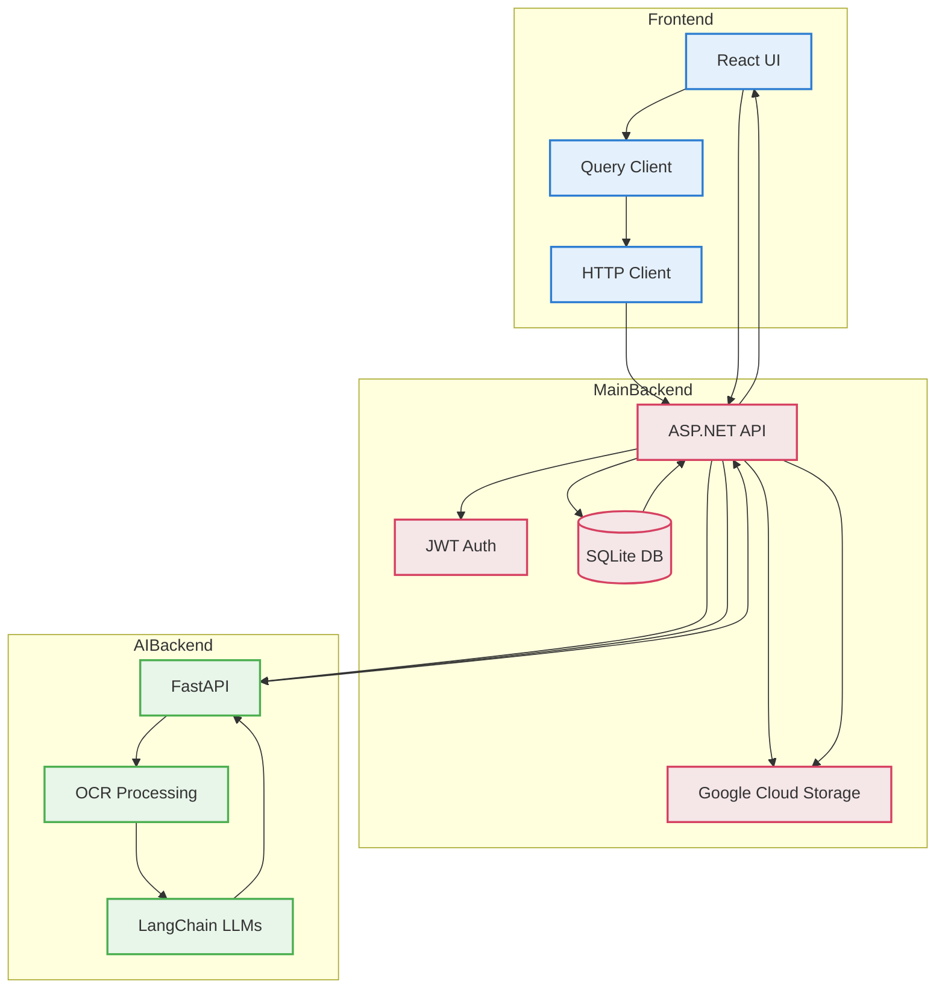

# ScanSplit - Bill Splitting Application

A comprehensive bill splitting application with React frontend, .NET backend, and AI-powered receipt scanning capabilities.

## System Architecture

The application consists of three main components:

1. **Frontend Web (React + TypeScript)**
   - Modern web interface built with React 18.3
   - Rich UI components using Radix UI
   - Responsive design with Tailwind CSS

2. **Main Backend (.NET 8)**
   - RESTful API built with ASP.NET Core
   - Entity Framework Core with SQLite database
   - JWT authentication
   - Group and bill management
   - Payment processing

3. **AI Backend (Python FastAPI)**
   - Receipt scanning and text extraction
   - Langchain for orchestrating a chain of LLMs
   - OCR processing
   - JSON response formatting

## System Architecture Diagram



## Features

### Frontend
- Built with React 18.3 and TypeScript
- Complete UI component library using Radix UI
- Form handling with React Hook Form
- Data fetching with TanStack Query
- Theme support with next-themes
- Toast notifications with Sonner
- Charts with Recharts
- Animation support with Framer Motion

### Main Backend
- User authentication and authorization
- Group management system
- Bill creation and management
- Payment tracking
- Cloud storage integration for images
- Currency handling
- Settlement calculations

### AI Backend
- Receipt image processing
- Text extraction from images
- Structured data output
- RESTful API endpoints

## Prerequisites

- Node.js (version 18.18.0 or higher)
- .NET SDK 8.0
- Python 3.8+
- Conda
- SQL Server or SQLite
### Optional
- Docker

## Installation

### Frontend Web
```bash
cd frontendweb
npm install
```

### Main Backend
```bash
cd MainBackend
dotnet restore
```

### AI Backend
```bash
cd AIBackend
conda env create -f environment.yml
conda activate scan-split
```

## Development

### Frontend Web
```bash
cd frontendweb
npm run dev
```

### Main Backend
```bash

cd MainBackend
dotnet run
```


### AI Backend
```bash
cd AIBackend
uvicorn main:app --host 0.0.0.0 --port 8000 
```
You can also run it via Docker:
```bash
source .run-docker.sh
```

**Important:**
Always remember to change the URL to the AIBackend API inside the MainBackend Project - BillController.cs
```CSharp
// Change the endpoint inside MainBackend project BillController.cs
var fastApiUrl = "https://ai-backend:8000"; // Line 66
```


## API Documentation

### Main Backend Endpoints

The .NET backend provides the following main API endpoints:

- **Auth Controller**
  - POST /auth/register - User registration
  - POST /auth/login - User authentication

- **Bill Controller**
  - POST /bill/{groupId} - Create new bill
  - GET /bill/{id} - Get bill details
  - PATCH /bill/{billId}/ImagePath - Update bill image

- **Group Controller**
  - POST /group/create - Create new group
  - GET /group/{id} - Get group details
  - POST /group/{idGroup}/add-user-by-login - Add user to group

### AI Backend Endpoints

- GET / - Health check
- POST /upload-photo - Process receipt image

## Database Schema

The main backend uses Entity Framework Core with the following main entities:

- User
- Group
- Bill
- MenuItem
- Payment
- Location
- Transfer

## Technology Stack

### Frontend
- React 18.3
- TypeScript
- Vite
- Radix UI
- Tailwind CSS
- TanStack Query

### Main Backend
- .NET 8
- Entity Framework Core
- JWT Authentication
- SQLite Database
- Google Cloud Storage

### AI Backend
- Python 3.11+
- Conda
- FastAPI
- Pillow
- OpenAI API Key

## Contributing

We love your input! We want to make contributing to ScanSplit as easy and transparent as possible, whether it's:

- Reporting a bug
- Discussing the current state of the code
- Submitting a fix
- Proposing new features
- Becoming a maintainer

### Development Process
1. Fork the repo and create your branch from `main`
2. If you've added code that should be tested, add tests
3. If you've changed APIs, update the documentation
4. Ensure the test suite passes
5. Make sure your code lints
6. Issue that pull request!

### Any contributions you make will be under the MIT Software License
In short, when you submit code changes, your submissions are understood to be under the same [MIT License](http://choosealicense.com/licenses/mit/) that covers the project. Feel free to contact the maintainers if that's a concern.

### Report bugs using Github's [issue tracker](../../issues)
We use GitHub issues to track public bugs. Report a bug by [opening a new issue](../../issues/new); it's that easy!

### Write bug reports with detail, background, and sample code

**Great Bug Reports** tend to have:

- A quick summary and/or background
- Steps to reproduce
  - Be specific!
  - Give sample code if you can
- What you expected would happen
- What actually happens
- Notes (possibly including why you think this might be happening, or stuff you tried that didn't work)

### Code Style

* Use TypeScript for frontend code
* Follow C# conventions for backend code
* Use PEP 8 style guide for Python code
* 2 spaces for indentation
* 80 character line length
* Use meaningful variable names

## License

MIT License

Copyright (c) 2025 ScanSplit

Permission is hereby granted, free of charge, to any person obtaining a copy
of this software and associated documentation files (the "Software"), to deal
in the Software without restriction, including without limitation the rights
to use, copy, modify, merge, publish, distribute, sublicense, and/or sell
copies of the Software, and to permit persons to whom the Software is
furnished to do so, subject to the following conditions:

The above copyright notice and this permission notice shall be included in all
copies or substantial portions of the Software.

THE SOFTWARE IS PROVIDED "AS IS", WITHOUT WARRANTY OF ANY KIND, EXPRESS OR
IMPLIED, INCLUDING BUT NOT LIMITED TO THE WARRANTIES OF MERCHANTABILITY,
FITNESS FOR A PARTICULAR PURPOSE AND NONINFRINGEMENT. IN NO EVENT SHALL THE
AUTHORS OR COPYRIGHT HOLDERS BE LIABLE FOR ANY CLAIM, DAMAGES OR OTHER
LIABILITY, WHETHER IN AN ACTION OF CONTRACT, TORT OR OTHERWISE, ARISING FROM,
OUT OF OR IN CONNECTION WITH THE SOFTWARE OR THE USE OR OTHER DEALINGS IN THE
SOFTWARE.

## Acknowledgments

- [Radix UI](https://www.radix-ui.com/) for the component library
- [FastAPI](https://fastapi.tiangolo.com/) for the AI backend framework
- [Entity Framework Core](https://docs.microsoft.com/en-us/ef/core/) for the ORM